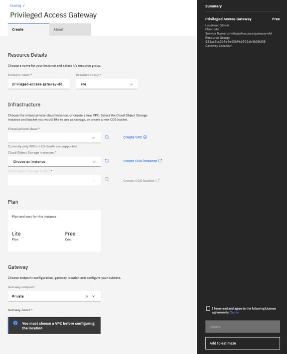
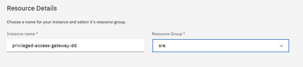
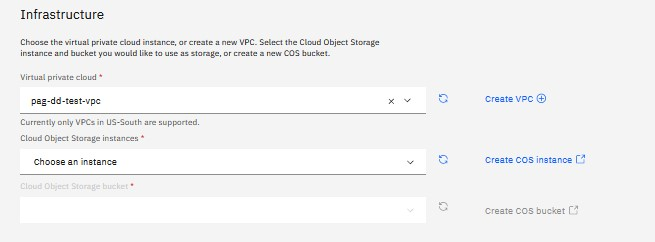
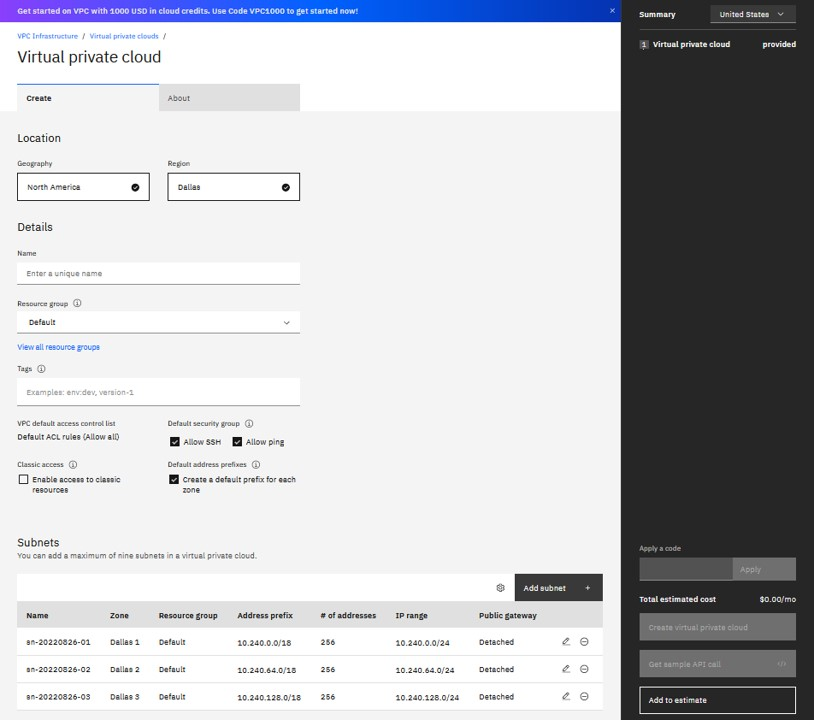
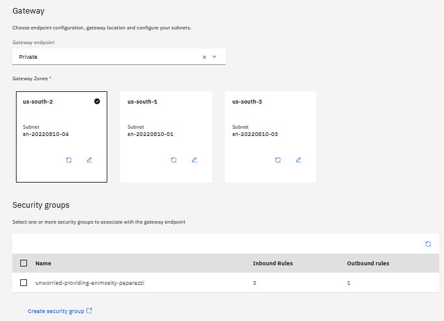
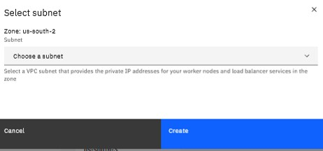

---

copyright:
  years: 2022
lastupdated: "2022-09-13"

keywords: provisioning PAG, catalog, UI, infrastructure, resouces, gateway, VPC

subcollection: privileged-access-gateway

---

{{site.data.keyword.attribute-definition-list}}

# Provisioning PAG using Catalog UI
{: #pag-provisioning-ui}

Before provisioning {{site.data.keyword.pag_full}} (PAG), ensure that the [Prerequisites](/docs/privileged-access-gateway?topic=privileged-access-gateway-pag-requirements) have been completed.
1. Visit [IBM Cloud™ Platform account](http://cloud.ibm.com/) and enter your credentials to log in.
2. After the login is successful. Go to the **Catalog Page**.
3. Select **Security** from the category list. This step is different because for the initial release it is located under the Experimental services link.
4. Search for **Privilege Access Gateway** and select it, this opens a page for creating your service instance of Privilege Access Gateway.

    {: caption="Figure 1. Creating a service instance" caption-side="bottom"}

## Completing the Resource Details' section
{: #completing-the-resource-details-section}

{: caption="Figure 2. Resource Details" caption-side="bottom"}

1. Create a unique name for your gateway by using lowercase alphanumeric characters and hyphens only (without spaces).
2. Select a resource group from the drop-down list, and optionally supply tags for your resource.

## Completing the Infrastructure section
{: #completing-the-infrastructure-section}

{: caption="Figure 3. Infrastructure" caption-side="bottom"}

1. In this section, you need to specify the {{site.data.keyword.vpc_full}} (VPC) you want the PAG gateway to reside in, as well as the {{site.data.keyword.cos_full}} (COS) instance and bucket where you want the session recordings to be stored. Start with the VPC selection to begin the process.

2. Choose an existing VPC instance, or create a new VPC.  If you choose to create a new VPC, click Create VPC and enter values for the fields showing.

{: caption="Figure 4. Create a VPC" caption-side="bottom"}

For more information on using the IBM Cloud console to create VPC resources, reference this page [Getting started with Virtual Private Cloud (VPC)](https://cloud.ibm.com/docs/vpc?topic=vpc-getting-started) and [Creating and configuring a VPC](https://cloud.ibm.com/docs/vpc?topic=vpc-getting-started#create-and-configure-vpc).
3. Select an existing COS instance, or create a new instance. For more information, see [Creating a service instance](https://cloud.ibm.com/docs/cloud-object-storage/basics?topic=cloud-object-storage-provision#provision-instance).
4. Select an existing COS bucket, or create a new bucket. This is where you specify the COS bucket for storing the session recordings. For more information, see [Create some buckets to store your data](https://cloud.ibm.com/docs/cloud-object-storage/about-cos.html#gs-create-buckets).

## Completing the Gateway section
{: #completing-the-gateway-section}

{: caption="Figure 5. Gateway" caption-side="bottom"}

### Completing the Gateway > location section
{: #completing-the-gateway-location-section}

1. Specify the zone within the us-south that the gateway should reside.  Only one zone is allowed at this time for this release, but more are planned in the future for high availability.
2. Select a VPC subnet that you want your PAG gateway to reside on within the selected zone.

{: caption="Figure 6. Subnet" caption-side="bottom"}

### Completing the Security groups' section
{: #completing-the-security-groups-section}

This section lists the existing security groups that you have in the selected VPC.

1. Select one or more security groups that you want associated with the PAG gateway network interface.

   You must allow ingress of ports 7200 through 7202 at a minimum to support PAG.
{: note}

2. You can create a security group.  See [Controlling traffic with VPC security groups](https://cloud.ibm.com/docs/openshift?topic=openshift-vpc-security-group).

### Completing the process
{: #completing-the-process }

1. Click Create to submit your order, which may take several minutes to complete the process before your instance of PAG is provisioned.
2. Go to the resource list and select the PAG service instance in the Security section.
3. When the status indicates that the provisioning is complete, select your PAG service instance to bring up the PAG dashboard.

